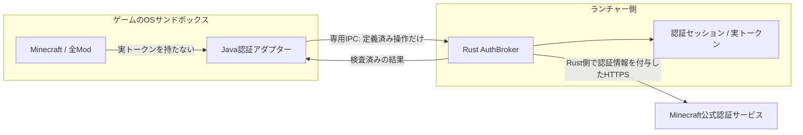

# アクセストークンをゲームへ渡さない認証仲介の計画

作成日: 2026-09-13。調査対象: `ff73a80`。以下は当初の設計案。実装・検証の進捗は次項に分けて記録する。

## 実装状況（2026-09-14）

`codex/auth-broker` でRust限定API・Java authlibアダプター・Unix IPCを実装中。実トークンをゲーム起動用Identityから取り除き、引数は認証能力を持たない固定値になった。UnixのIPCはパス名を持たない `UnixStream::pair` の片端をFD 3として継承する方式に具体化し、Javaの初期化でCLOEXECと非ブロッキングを設定する。TCPの待受・環境変数の秘密・公開仮トークンによる接続を追加しない。

macOS Seatbelt上の1.21.8 / 26.2、およびLinux bubblewrap上の26.2 + Fabric 0.19.5で、実ゲームからRustへのhelloと読み出しModの動作を確認。直接受け渡しの正の対照はUser/Sessionから検証用トークンを検出し、仲介後は同じ探索範囲から検出しなかった。追加した生存中Javaヒープのダンプ検査でも、直接受け渡しで検出・仲介後で非検出となった。結果と再現方法は `tools/auth-broker-probe/` に記録。検証用トークンはランダムな合成値で、実アカウントの資格情報を使っていない。

認証仲介の起動前にMinecraft / authlib / Java / loaderの組を照合する互換表を追加。1.21.8 / authlib 6.0.58 / Java 21、26.2 / authlib 9.0.75 / Java 25と、VanillaまたはFabric 0.19.5を試験対象とする。authlibの実ファイルをサイズとSHA-256で照合し、未知の構成・破損・Fabric側のauthlib上書きを拒否する。macOSの両バージョンとLinuxの26.2でFabric回帰試験が成功。これはリリース対応表ではなく、オンライン検証前の試験対象表である。結果は `tools/auth-broker-probe/compatibility-2026-09-14.json`。

固定のJoinServer / UserProperties / BlockListを実装し、HTTPモックでアカウント固定・redirect拒否・応答上限・失効時の結果破棄を検査。IPCは余分なフィールド、不正フレーム、再送、過剰要求、通信禁止、セッション失効を検査する。アダプターは未対応操作を明示的に拒否する。

設定は `accountAuthentication: disabled | brokered` に移行済み。旧boolは読み込み時に変換し、保存時は新形式だけを出す。新旧フィールド重複は同じ値でも拒否する。権限画面は初期OFF・通信との独立・起動中のModによる仲介利用・未対応範囲を表示し、保存失敗時の設定維持と再試行を検査した。

署名鍵保持と署名仲介も実装。Rustは取得したRSA秘密鍵を起動中だけ保持し、ゲームへは公開証明書と不透明な鍵識別子を返す。JavaのCrypt変換とJCA Providerで、秘密鍵のエンコードを返さず署名をRustへ依頼する。Rust側でMinecraftの署名形式、送信者UUID、セッション・連番、時刻、サイズ、有効期限を検査し、再送や任意データへの署名を拒否する。同じ起動中のModによる有効形式のチャット署名は区別できない。

macOS上で公式1.21.8 / Java 21 / authlib 6.0.58と26.2 / Java 25 / authlib 9.0.75の実クラスを使った別JVM検証が成功。Minecraft自身が作る署名データをMinecraftのSigner経由でRustへ渡し、戻った署名を公開鍵で検証した。識別子の鍵読み込み・書き出し、前回起動の識別子拒否、通常RSAの維持も確認。これは合成鍵と無効な発行者署名によるIPC互換試験であり、Mojang発行証明書の取得・検証やオンライン参加の証明ではない。再現手順は `tools/auth-broker-probe/README.md`。 LinuxのUTM検証VMでも26.2の公式クラス署名とFabric回帰が成功した。1.21.8は既存のLWJGL 3.3.3 Linux ARM64ネイティブ未対応により起動前に拒否された。IPC待機中の失効も250 msごとに検査し、鍵を持つ処理を終了させる。

macOS / 26.2 / Fabric 0.19.5では、実アカウントでローカルの `online-mode=true`・`enforce-secure-profile=true` サーバーへの参加、署名付きチャットの受信、別プロセスでの再接続が成功した（2回）。実チャットセッション内の鍵がエンコード不能な不透明オブジェクトであることも確認。結果は `tools/auth-broker-probe/online-macos-26.2-2026-09-14.json`。他の構成の実オンライン接続、実接続中の鍵期限切れ・複数インスタンス、実アカウント署名鍵のヒープ探索、Windows IPC、Linuxの追加バージョン、非生存オブジェクトを含む全ヒープ・ネイティブ全体・その他のランチャーメモリ経路の探索はまだ未完了。Fabric Modから合成トークンの正確な親アドレスを対象にしたOSメモリ読取試験も追加し、詳細は検証READMEへ分けて記録する。以前の直接受け渡しで作られた公式の `profilekeys` キャッシュを起動前に削除する処理を実装。認証OFF・未ログイン時にも適用し、削除失敗ならゲームを起動しない。リンク先をたどらず、キャッシュ内容を読み出し・ログ出力・バックアップしない。これは既に盗まれた資格情報、別の場所へ複製された鍵、バックアップからの回収や安全な消去を保証しない。以下のリリース判定を満たした状態ではない。

公開の合成RSA鍵による実Fabricヒープ探索も追加。macOS 1.21.8・26.2とLinux 26.2で、直接対照は鍵エンコード・Cryptの保存形式・生存中ヒープから検出でき、仲介後は同じ条件で非検出となった（計6回）。結果と限定した表現・メモリ範囲は `tools/auth-broker-probe/chat-key-heap-2026-09-14.json` に記録。この試験の無効な発行者署名を使う合成証明書は、実オンライン接続の検証と分ける。

## 目的と保証の範囲

MinecraftアクセストークンをRust側のメモリだけで保持し、ゲームには認証結果だけを返す。Javaの起動引数・環境変数・Sessionオブジェクト・Java Agent・ゲームから読めるファイル・IPC応答へ実トークンを入れない。Microsoftアクセストークンと更新トークンも引き続きゲームへ渡さない。

ゲームと全Modを一つの信頼できないプロセス群として扱う。Java側の改変防止を安全性の根拠にせず、秘密と操作の許可判定をOSサンドボックスの外に置く。ホストOS・ランチャー・管理Javaランタイムが侵害されていないことが前提。

この方式で防ぐのは、実トークンを盗み、ゲーム終了後に別環境から再利用する経路。起動中の悪意あるModによる許可済み認証操作の呼び出しや、外部から受け取った要求の中継までは防げない。特に `joinServer` のserver hashはModも指定できるため、仲介だけで「本人が選択したサーバーへの接続」とは証明できない。レート制限や要求IDも本人操作の証明にはならない。

サーバー接続先やハンドシェイクまで信頼境界の外で検証するには、別途ゲーム通信そのものの仲介が必要。その場合も悪意あるModからの操作を完全に判別できるとは扱わず、今回のトークン非開示と分ける。

## 確認した現状

- `src-tauri/src/auth/minecraft_services.rs`: MinecraftSessionに実トークンを保持。
- `src-tauri/src/commands/auth.rs`: 認証・更新をsingle-flight化し、セッションを期限付きでキャッシュ。現在のサインアウトはキャッシュと保存済み更新トークンを消す。
- `src-tauri/src/commands/minecraft.rs`: `accessToken` がONなら実トークンをMinecraftIdentityへ複製。
- `src-tauri/src/minecraft/launcher.rs`: 実トークンを `${auth_access_token}` へ展開。ここを置き換える。
- 通信許可はInternet/LAN全体のON/OFFであり、宛先別フィルターではない。Windowsのloopbackは自動解除していない。
- Windowsの起動処理はstdout/stderrハンドルだけを明示継承。Linuxはbubblewrapのnamespaceとseccompを使用し、macOSはSeatbeltを使用。認証用の双方向IPCはまだない。
- 管理済みの公式authlib 6.0.58（Minecraft 1.21.8）と9.0.75（26.2）を `javap` で確認。双方に `joinServer(UUID, String, String)`、User APIのプロパティ・ブロック一覧・鍵取得・通報操作がある。`KeyPairResponse.KeyPair` は秘密鍵文字列を含む。JARのSHA-1はローカル公式バージョンメタデータの値と一致した。これは静的なAPI確認であり、仲介の動作証明ではない。

## 採用する構成

Java Agentでauthlibの対応メソッドを起動時に差し替え、Rust AuthBrokerの操作へ変換する。ゲームのトークン欄は公式サービスでは認証できない固定プレースホルダーとする。プレースホルダー自体には仲介権限を持たせない。

通常のHTTPSプロキシ設定だけでは、CONNECTトンネル内の暗号化された認証情報を置換できない。TLSを復号する方式では独自CA・信頼ストア・複数HTTP実装への対応も必要になるため、今回は認証API単位で仲介する。ゲームサーバー向けTCP通信は既存のネットワーク権限に従う。[Java Networking](https://docs.oracle.com/en/java/javase/21/core/java-networking.html)

### IPC

第一候補は起動ごとに作る専用の継承パイプ2本による双方向通信。stdout・stderr・ナレータープロトコルとは混在させない。待受TCPポートを作らず、公開可能な仮トークンだけで第三者が仲介を利用できる構成にしない。

- Windows: `PROC_THREAD_ATTRIBUTE_HANDLE_LIST` に認証用の子側ハンドルだけを追加。親側ハンドルの継承禁止、起動失敗時の閉鎖、別AppContainerからの複製・利用拒否を実機検証する。
- macOS: 子側FDだけを継承し、Seatbelt下の専用IPCが動作するか検証する。親プロセスのメモリ・他のFDへのアクセスを許可しない。
- Linux: bubblewrapによるFD保持とexec後のFD配置を実証する。既存のseccomp用FDと混同せず、必要なIPCのためにhost network共有を追加しない。
- JavaからのネイティブHANDLE/FD操作は小さなJNIブリッジに限定する。秘密は置かない。非公開JDK APIへの依存を避ける。
- 固定スキーマ・長さ付きフレーム・要求ID・読み書き期限・同時要求数上限を定義。起動nonceは取り違え検知用であり、同じゲーム内のModから秘密にできる値とは扱わない。
- FD/HANDLE継承が特定OSで成立しなければ、そのOSは未対応とする。代案のnamed pipe/Unix socketはアクセス制御・接続元・寿命を個別検証してから採用する。Windows named pipeも名前の秘匿だけに頼れない。[Named Pipes](https://learn.microsoft.com/en-us/windows/win32/ipc/named-pipes)

### Rust AuthBroker

ゲームから任意のURL・HTTPメソッド・ヘッダー・アクセストークン・別アカウントIDを受け取る汎用プロキシにはしない。各操作について宛先・メソッド・本文・返却フィールドをRust側で組み立てる。

| 操作                          | 入力・振る舞い                                                                      | 返すもの                           |
| ----------------------------- | ----------------------------------------------------------------------------------- | ---------------------------------- |
| JoinServer                    | server hashを形式・サイズ検査。UUIDと実トークンは起動時に固定したアカウントから取得 | 成功または分類済みエラー           |
| GetUserProperties             | 起動アカウントの実際の権限・制限を取得。マルチプレイ禁止等を許可に書き換えない      | 必要な公開プロパティ               |
| GetBlockList                  | 起動アカウントのブロック一覧を取得。短時間キャッシュ                                | UUID一覧                           |
| GetChatCertificate / SignChat | 後述の独立工程で実装                                                                | 公開証明書・署名。秘密鍵は返さない |

宛先は固定の公式HTTPSエンドポイントだけ。証明書検証を有効にし、HTTP redirect・ユーザー指定proxy・環境由来proxyを無効化する。本文・応答サイズ、timeout、キュー長を制限。エラー本文やHTTPヘッダーをそのままゲームへ返さず、許可したフィールドへ変換する。通報・テレメトリ・Realms・スキン更新等は操作を個別設計するまで追加しない。未対応操作は明示的な未対応結果とし、架空の成功を返さない。

セッションを `launch_id + instance_id + account_id + account_generation` に固定する。ゲームからアカウントを選ばせない。トークン更新は既存single-flight処理を再利用するが、アカウント切替後に別人のトークンを返さないよう認証管理を分離する。

ゲーム終了・起動失敗・IPC切断・ランチャー終了で仲介セッションを破棄。サインアウト・アカウント切替でgenerationを進め、進行中の更新結果やHTTP応答も破棄する。要求の実行直前と応答返却直前にgenerationを検査する。既に公式サービスで実行された処理や、成立済みのゲーム接続をサインアウトで取り消せるとは扱わない。

### 署名付きチャット

`joinServer` だけの仲介で全マルチプレイ対応とはしない。公式1.19.1リリースで署名付きチャットと `enforce-secure-profile=true` の既定化が示されている。[公式リリースノート](https://www.minecraft.net/en-us/article/minecraft-java-edition-1-19-1)

鍵取得APIのレスポンスを丸ごとゲームへ戻すと、アクセストークンは隠せてもチャット用秘密鍵はゲームへ出る。今回の推奨設計では秘密鍵もRust側に保持し、ゲームの署名処理を追加アダプターで仲介する。署名対象の形式・セッション・時刻・連番・サイズ・期限を検証する。ただし、許可された形式の悪意あるチャット署名まで本人操作と区別できるとは保証しない。

公開証明書への置換だけでは、ゲームが要求する秘密鍵オブジェクトとの互換性は得られない。Java側の鍵生成・キャッシュ・署名呼び出し箇所を対象バージョンごとに確認し、秘密鍵キャッシュが作られないことも確認する。この工程が終わるまでsecure profile対応を表示しない。チャット署名キーの非開示はトークン非開示より追加の範囲であり、工程と検証結果を分けて報告する。

## パーミッションと互換性

提案: 既存の直接受け渡しを「アカウント認証の仲介」に置き換える。初期値は引き続きOFF。内部は `accountAuthentication: disabled | brokered` とし、直接受け渡しへの自動フォールバックを廃止する。

- 旧 `accessToken=false` または項目なし → disabled。
- 旧 `accessToken=true` → brokered。未対応OS・バージョンでは理由を示し、トークンを直接渡して起動しない。
- 新旧項目が同時にあって矛盾する設定は保存・移行で拒否する。移行処理は既存のstrictなserde検査と整合させる。
- 通信権限は独立して保存する。初期実装の認証仲介は通信ONのときだけ有効とし、通信OFFなら設定を保持して外部認証要求を拒否する。設定変更で通信を自動許可しない。
- デモ・未ログイン時は仲介セッションを作らない。
- 説明文には「実トークンを渡さず認証を仲介する」「全Modも起動中は許可された認証操作を利用できる」「次回起動から適用」を明記。
- 対応するMinecraft/authlib/Java/loaderの組をバックエンドの互換表で判定。未知の構成は未対応とする。任意のMod・別のHTTPクライアント・認証差し替えModの互換性は自動保証しない。

## 実装順序と完了条件

1. **互換性とIPCの実証**: 最初は1.21.8 / authlib 6.0.58 / Vanillaで、認証呼び出しと署名・キャッシュ経路を一覧化。3 OSそれぞれでゲームサンドボックスから専用IPCの往復、別インスタンス拒否、終了時切断を実証する。26.2 / authlib 9.0.75は次の互換対象。ここで成立しないOSは保留。
2. **Brokerの土台**: `src-tauri/src/auth/broker/` に操作型・起動セッション・寿命・レート制限・公式APIクライアントを実装。認証管理からトークンをゲーム起動コードへ返さないAPIへ変更。モックHTTPで秘密非開示、redirect拒否、過大入力、失効と更新競合を検査。
3. **Javaアダプターと最小接続**: `src-tauri/java/auth-bridge/`、`build.rs`、launcher、3 OSの起動処理を接続。AgentとJNIは読み取り専用のランチャー管理領域に配置。実トークンの展開経路を削除し、brokered起動失敗時に直接渡さない。最初は管理された検証サーバーでonline-mode参加を確認し、secure profile未対応の試作であることを明示。
4. **署名と必要User API**: 秘密鍵保持・署名仲介・権限制限・ブロック一覧を追加。`online-mode=true` かつ `enforce-secure-profile=true` の検証サーバーで参加と署名付きチャットを確認。鍵期限切れ・再接続・複数インスタンスを検査。Fabricを加えて同じ検査を実行する。
5. **設定移行と画面**: permissions、IPC型、既存Permissions部品を変更。保存失敗・旧設定・未対応表示・通信OFF・未ログインを確認。デザイン定義とガイドを更新し、既存トークンを使用する。
6. **攻撃側からの検証と公開判定**: 実トークンを探す試験Mod・ネイティブ試験コードで、引数・環境・Javaヒープ・読み取り可能ファイル・IPC・ログを確認。別インスタンスや別プロセスからの利用、ランチャーメモリ読取、終了後再利用を各OSで検査。成果を「トークン非開示」「署名鍵非開示」「限定操作の悪用余地」「実接続成功」に分けて記録する。

各工程は意味のある単位でコミットし、UI変更時は `pnpm check` と `pnpm test:ui`、Rustはfmt/test/clippy、Java/JNIはビルドとプロトコル・実プロセステストを実施する。IPCモックやJARの静的確認を、Windows AppContainer・macOS Seatbelt・Linux bubblewrapでの実機成功の代わりにしない。

## リリース判定

対応表に記載する各構成で、既定OFF、旧設定移行、ON時の実トークン非開示、実online-mode接続、secure profileとチャットの状態、サインアウト失効、複数インスタンス分離、破損・未知アダプターでの安全な停止が確認できること。

Realms、認証を独自実装するMod、通報・テレメトリ等の追加APIは次段階。サーバーの安全設定を変更しなければ接続できない状態を、一般向けマルチプレイ対応の完了にしない。既に直接受け渡しで起動しているゲームからトークンを回収することはできないため、移行の保護は新方式での次回起動から有効。

参照した公式配布物: [authlib 6.0.58](https://libraries.minecraft.net/com/mojang/authlib/6.0.58/authlib-6.0.58.jar)、[authlib 9.0.75](https://libraries.minecraft.net/com/mojang/authlib/9.0.75/authlib-9.0.75.jar)。配布物はリポジトリへ追加しない。
